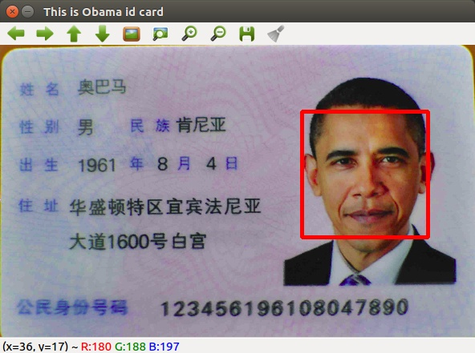

#### 利用php-opencv检测人脸


* php-opencv库: https://github.com/hihozhou/php-opencv
* OpenCV 4.0.0+
* PHP7.0+

#### Example
```php
<?php

include "FaceRecognition.php";

$imgPath = "demo-img/Obama.png";

// 获取人脸检测有结果，可能有多个人脸
$FaceRecognition = new FaceRecognition($imgPath);
$faces           = $FaceRecognition->getFaceResult();
var_dump($faces);

// 框出人脸位置,生成新的图片，位于result-img目录
$FaceRecognition->drawFaceFrame($faces);
$FaceRecognition->createRetImg();
```

#### Result
